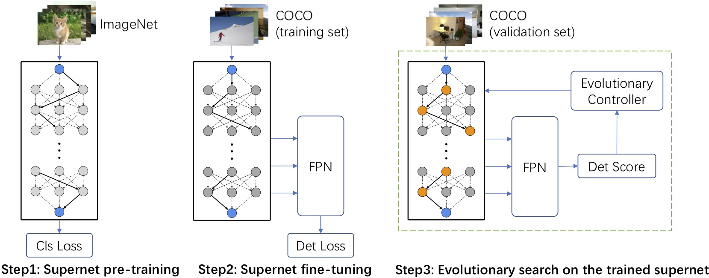

# DetNAS
This project provides the implementation for [DetNAS: Backbone Search for Object Detection](https://arxiv.org/abs/1903.10979).
As we originally conducted the experiments in the paper using the internal framework Brain++, this project is a reimplemented version on PyTorch.
In addition, this project is based on [maskrcnn-benchmark](https://github.com/facebookresearch/maskrcnn-benchmark).



## Installation
- Modify the path to your coco dataset in config.sh.
- `bash config.sh`

## Trained Models

| Model | ImageNet acc| AP (minival) |  GoogleDrive |
| --- | :---: | :---: | :---: |
| DetNAS-COCO-FPN-300M | 26.2 | 36.6 | [ImageNet](https://drive.google.com/file/d/14cMxdJq5_ELOB-4J1K6DF1MbaDtaEOmw/view?usp=sharing)&emsp;[COCO](https://drive.google.com/drive/folders/1JBOwmHoImfejerApL_GTfDLoAZnU5hIq?usp=sharing)|
| DetNAS-COCO-FPN-1.3G | 22.8 | 40.3 | [ImageNet](https://drive.google.com/file/d/1Kkyb_Y3BVGYGiZ44Y1Zv51quuymcn6z2/view?usp=sharing)&emsp;[COCO](https://drive.google.com/drive/folders/1acPy4pqSMd26Y1-dgPm4oKrDHboSDYkN?usp=sharing)|
| DetNAS-COCO-FPN-3.8G | 21.6 | 42.0 | [ImageNet](https://drive.google.com/file/d/1Wk79vAt0PsC5ImdyPJliGmvdWzZQLCEk/view?usp=sharing)&emsp;[COCO](https://drive.google.com/drive/folders/1laqDssuciUtxiY9vJv2-x27VyxvylBWN?usp=sharing)|
| DetNAS-COCO-RetinaNet-300M | 26.0 | 34.1 | [ImageNet](https://drive.google.com/file/d/1L0WfmULKXD95ysLMMtD9SgMr8KWuDdsw/view?usp=sharing)&emsp;[COCO](https://drive.google.com/drive/folders/10dvSzIyfhWRvxZZ1GQ-FEG6QNuxoGlRx?usp=sharing)|


The training scripts of these model are in the dirctory `scripts/`. For training,
- Download the ImageNet model to the directory `ImageNet-Pretrain-models/`.
- `bash scripts/run_detnas_coco_fpn_300M.sh`

## Search for networks
### Step 1: setup Dataset
- We have splitted 5000 images from `coco_2014_train`+`coco_2014_valminusminival` as the validation set for search. The remainings are used for supernet training. 
- Download the splitted train and val json files ([GoogleDrive]()) to `datasets/coco/annotations`.
- (You can replace them with your own datasets.)

### Step 2: Supernet training
#### ImageNet pre-training
- Download the ImageNet supernet model ([GoogleDrive](https://drive.google.com/file/d/1ia8IId-OLqvb-603P4JH3lXToFjaMWHm/view?usp=sharing)) to the directory `ImageNet-Pretrain-models/`.
- If necessary, you can also [train models ImageNet](https://github.com/megvii-model/ShuffleNet-Series) by yourselves.
#### COCO training
- `bash scripts/run_detnas_coco_fpn_300M_search.sh`
- ('-search' in cfg.MODEL.BACKBONE.CONV_BODY is to distinguish supernet training from single model.)

### Step 3: setup a server for the distributed search
```
tmux new -s mq_server
sudo apt update
sudo apt install rabbitmq-server
sudo service rabbitmq-server start
sudo rabbitmqctl add_user test test
sudo rabbitmqctl set_permissions -p / test '.*' '.*' '.*'
```

### Step 4: start a new tmux for search
- `tmux new -s search`
- modify `host` and `log_dir` in the config file `distributed_arch_search/arch_search_config.py`.
- `bash distributed_arch_search/run_search.sh`
- (`run_search.sh` requires no **GPUs**.)

### Step 5: start new tmuxs for model evaluation
- `tmux new -s server_x`
- modify `config-file` and `MODEL.WEIGHT` in the script file `distributed_arch_search/run_server.sh`.
- `bash distributed_arch_search/run_server.sh`
- (You can start more than one `run_server.sh` to speed up, if you have enough **GPUs** and **memory** researces.)

## Citation
Please cite DetNAS in your publications if it helps your research. 

```
@misc{chen2019detnas,
    title={DetNAS: Backbone Search for Object Detection},
    author={Yukang Chen, Tong Yang, Xiangyu Zhang, Gaofeng Meng, Xinyu Xiao, Jian Sun},
    year={2019},
    booktitle = {NeurIPS},
}
```
